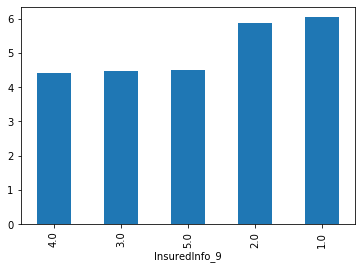
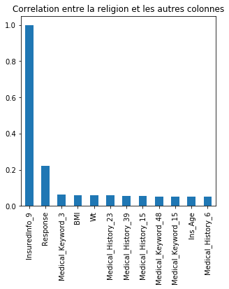
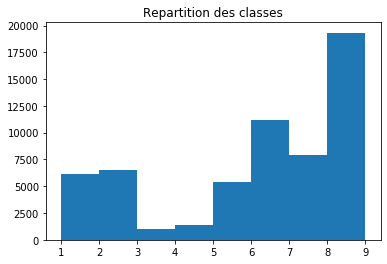
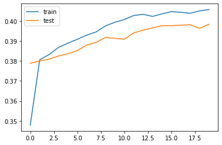
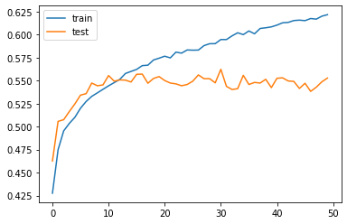
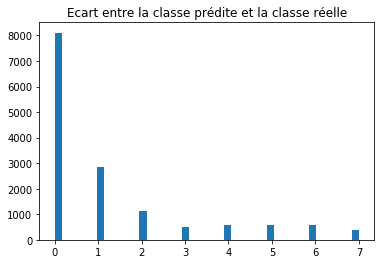
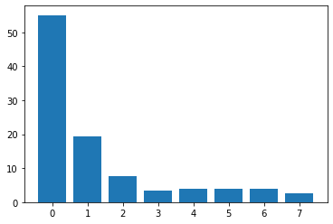
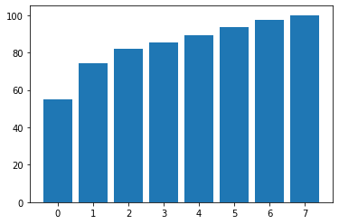
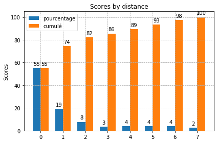
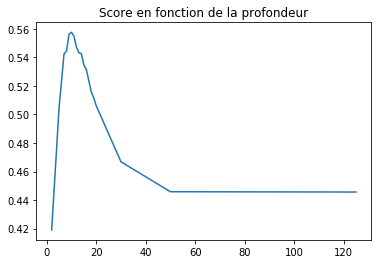

# PreProcessing


```python
from sklearn.model_selection import train_test_split
from sklearn.experimental import enable_iterative_imputer
from sklearn.impute import IterativeImputer, SimpleImputer
from sklearn.svm import SVC
import pandas
import numpy as np
from matplotlib import pyplot as plt
```


```python
X = pandas.read_csv('train.csv')
y=X['Response']
```


```python
X.Response.unique()
```


    array([7, 6, 1, 4, 2, 8, 5, 3])


```python
Xtrunc=X.loc[X.Response==1][:1000]

for i in range (2,9):
  Xtrunc=Xtrunc.append(X.loc[X.Response==i][:1000])
print(Xtrunc.Response.unique())
```

    [1 2 3 4 5 6 7 8]


```python
print(X.InsuredInfo_9.count()) #nb de gens ayant donné leur religion
print(len(X))
```

    14755
    58881


```python
religion=X.InsuredInfo_9.unique()
religion[1]=religion[0]
religion[0]=np.nan
print(religion)
```

    [nan 'Muslim' 'Jewish' 'Christian' 'Buddhist' 'Hindus']


```python
race=X.InsuredInfo_8.unique()
print(race)
```

    [nan 'Caucasian' 'Black' 'Arabic' 'African-American' 'Asian' 'Hispanic'
     'Latino']


```python
X['InsuredInfo_7']=X['InsuredInfo_7'].apply(lambda x: 0 if x=='Male' else 1)
X['InsuredInfo_8']=X['InsuredInfo_8'].apply(lambda x: np.nan if type(np.nan)==type(x) else np.where(race==x)[0][0])
X['InsuredInfo_9']=X['InsuredInfo_9'].apply(lambda x: np.nan if type(np.nan)==type(x) else np.where(religion==x)[0][0])
X['Product_Info_2']=X['Product_Info_2'].apply(lambda x: int(x,16))
print(X.InsuredInfo_7.unique())
print(X.InsuredInfo_8.unique())
print(X.InsuredInfo_9.unique())
```

    [1 0]
    [nan  1.  2.  3.  4.  5.  6.  7.]
    [ 1. nan  2.  3.  4.  5.]


```python
Xdec=X.copy()
```


```python
print(Xdec.groupby('InsuredInfo_7').mean().Response)
print(Xdec.groupby('InsuredInfo_8').mean().Response)
print(Xdec.groupby('InsuredInfo_9').mean().Response)

X.groupby('InsuredInfo_9').mean().Response.sort_values().plot.bar()
```

    InsuredInfo_7
    0    5.471703
    1    5.858765
    Name: Response, dtype: float64
    InsuredInfo_8
    1.0    5.564054
    2.0    5.604052
    3.0    5.000000
    4.0    6.081794
    5.0    5.455919
    6.0    6.166667
    7.0    6.084746
    Name: Response, dtype: float64
    InsuredInfo_9
    1.0    6.046136
    2.0    5.863776
    3.0    4.479210
    4.0    4.411552
    5.0    4.486128
    Name: Response, dtype: float64


    <matplotlib.axes._subplots.AxesSubplot at 0x7fe62d5fe128>





```python
col1='InsuredInfo_9'

print(Xdec.groupby(col1)['Ht'].mean())


cr=Xdec[Xdec.columns[1:]].corr()[col1].abs()>0.1
idxs=Xdec[Xdec.columns[1:]].corr()[col1][cr].index
vals=X[col1].unique()
for col in idxs:
  if col !=col1:
    if col!='Response':
      for idx in vals:
        if idx is np.nan:
          Xdec.loc[Xdec[col1]==idx,col]=Xdec.loc[Xdec[col1].isnull(),col]-Xdec.loc[Xdec[col1].isnull(),col].mean()
        else:
          Xdec.loc[Xdec[col1]==idx,col]=Xdec.loc[Xdec[col1]==idx,col]-Xdec.loc[Xdec[col1]==idx,col].mean()

print(Xdec.groupby(col1).mean()['Ht'])
```

    InsuredInfo_9
    1.0   -0.000824
    2.0   -0.002199
    3.0    0.001034
    4.0    0.001696
    5.0    0.002654
    Name: Ht, dtype: float64
    InsuredInfo_9
    1.0   -0.000824
    2.0   -0.002199
    3.0    0.001034
    4.0    0.001696
    5.0    0.002654
    Name: Ht, dtype: float64


```python
Xplt=Xdec.copy()
col='InsuredInfo_9'
fig=plt.figure(figsize=(5, 5))
plt.title('Correlation entre la religion et les autres colonnes')
cr=abs(Xplt[Xplt.columns[1:]].corr()[col])<0.1
cr2=abs(Xplt[Xplt.columns[1:]].corr()[col])>0.05
Xplt[Xplt.columns[1:]].corr()[col][cr2].abs().sort_values(ascending=False).plot.bar()
plt.savefig('fig.png')
```





```python
X=Xdec.copy()
X[X.columns[1:]].corr()[col]['Ht']
```


    0.017634461262406705


```python
plt.hist(X['Response'], bins=[1,2,3,4,5,6,7,8,9], label=sorted(X.Response.unique()))
plt.title('Repartition des classes')
plt.savefig('repartition.png')
```





```python
#X=X.drop(columns=['InsuredInfo_7','InsuredInfo_8','InsuredInfo_9','Response'])
X=X.drop(columns='Response')
```


```python
#simp=IterativeImputer(max_iter=2, random_state=0)
simp=SimpleImputer()
Ximp=simp.fit_transform(X)
```


```python
Xtrunc=Ximp[:9999,:]
ytrunc=y[:9999]
```


```python
X_train, X_test, y_train, y_test = train_test_split(
    Ximp, y, random_state=0)
```


```python
# Use each type of scaler and train a SVC model for each one.
# Which one is the best ?

# MaxAbsScaler
from sklearn.preprocessing import MaxAbsScaler

scaler_maxabs = MaxAbsScaler()
scaler_maxabs.fit(Ximp)

X_train_scaled_maxabs = scaler_maxabs.transform(X_train)
X_test_scaled_maxabs  = scaler_maxabs.transform(X_test)


```

# SVC


```python
svc_maxabs = SVC(C=100, gamma="auto")
svc_maxabs.fit(X_train_scaled_maxabs, y_train)
print("[MaxAbsScaler] accuracy  =", svc_maxabs.score(
    X_test_scaled_maxabs, y_test))
```

# PCA


```python
X_scaled=scaler_maxabs.transform(Ximp)
```


```python
# Now we can use PCA.
from sklearn.decomposition import PCA

# Use the documentation of PCA to create a model that will
# only keep 2 components.
pca = PCA(n_components=5)

# Then call the .fit() method of PCA on your scaled data.
pca.fit(X_scaled)
```


    PCA(copy=True, iterated_power='auto', n_components=5, random_state=None,
        svd_solver='auto', tol=0.0, whiten=False)


```python
X_pca = pca.transform(X_scaled)
print("Shape before PCA:", X_scaled.shape)
print("Shape after PCA:", X_pca.shape)
```

    Shape before PCA: (58881, 125)
    Shape after PCA: (58881, 5)


```python
X_pca_train, X_pca_test, y_train, y_test = train_test_split(
    X_pca, y, random_state=7)
```


```python
svc_pca = SVC(C=100, gamma="auto")
svc_pca.fit(X_pca_train, y_train)
print("[pca] accuracy  =", svc_pca.score(
    X_pca_test, y_test))
```

    [pca] accuracy  = 0.4112


# Neural Network


```python
!pip install keras==2.3.0
```


```python
%tensorflow_version 2.x
import tensorflow
import keras
print(keras.__version__)
from keras.models import Sequential,load_model
from keras.layers import Dense, Dropout
from keras.utils import to_categorical
from keras.callbacks import EarlyStopping, ModelCheckpoint
from matplotlib import pyplot
```

    TensorFlow 2.x selected.
    2.3.0


    Using TensorFlow backend.


```python
y_trainInt = to_categorical(y_train)[:,1:]
y_testInt = to_categorical(y_test)[:,1:]
```


```python
np.unique(y_trainInt, axis=0)
```


    array([[0., 0., 0., 0., 0., 0., 0., 1.],
           [0., 0., 0., 0., 0., 0., 1., 0.],
           [0., 0., 0., 0., 0., 1., 0., 0.],
           [0., 0., 0., 0., 1., 0., 0., 0.],
           [0., 0., 0., 1., 0., 0., 0., 0.],
           [0., 0., 1., 0., 0., 0., 0., 0.],
           [0., 1., 0., 0., 0., 0., 0., 0.],
           [1., 0., 0., 0., 0., 0., 0., 0.]], dtype=float32)


# PCA+NN


```python
model_pca=Sequential()
model_pca.add(Dense(10, input_dim=5, activation='relu'))
model_pca.add(Dense(9, activation='softmax'))
```


```python
model_pca.compile(loss='categorical_crossentropy',
              optimizer='adam',
              metrics=['accuracy'])# adam
```


```python
# x_train and y_train are Numpy arrays --just like in the Scikit-Learn API.
history=model_pca.fit(X_pca_train, y_trainInt, epochs=20, validation_split=0.1)
```


```python
loss_and_metrics = model_pca.evaluate(X_pca_test, y_testInt)
print(loss_and_metrics)

# plot training history
pyplot.plot(history.history['accuracy'], label='train')
pyplot.plot(history.history['val_accuracy'], label='test')
pyplot.legend()
pyplot.show()
```

    14721/14721 [==============================] - 1s 49us/step
    [1.592750065519097, 0.4072413444519043]





# NN no PCA


```python
# define the keras model
model = Sequential()
model.add(Dense(128, input_dim=128, activation='relu'))
model.add(Dense(64, activation='relu'))
model.add(Dense(16, activation='relu'))
model.add(Dropout(0.2))
model.add(Dense(8, activation='softmax'))

```


```python
model.compile(loss='categorical_crossentropy',
              optimizer='adam',
              metrics=['accuracy'])# adam
```


```python
es = EarlyStopping(monitor='val_accuracy', mode='max', min_delta=1)
mc = ModelCheckpoint('best_model.h5', monitor='val_accuracy', mode='max', verbose=1, save_best_only=True)
```


```python
# x_train and y_train are Numpy arrays --just like in the Scikit-Learn API.
history=model.fit(X_train_scaled_maxabs, y_trainInt, epochs=50, validation_split=0.1, callbacks=[mc])
```

    Train on 39744 samples, validate on 4416 samples
    Epoch 1/50
    20256/39744 [==============>...............] - ETA: 2s - loss: 1.0480 - accuracy: 0.6251


    ---------------------------------------------------------------------------

    KeyboardInterrupt                         Traceback (most recent call last)

    <ipython-input-34-9e20bd8cc59f> in <module>()
    ----> 1 history=model.fit(X_train_scaled_maxabs, y_trainInt, epochs=50, validation_split=0.1, callbacks=[mc])
    

    /usr/local/lib/python3.6/dist-packages/keras/engine/training.py in fit(self, x, y, batch_size, epochs, verbose, callbacks, validation_split, validation_data, shuffle, class_weight, sample_weight, initial_epoch, steps_per_epoch, validation_steps, validation_freq, max_queue_size, workers, use_multiprocessing, **kwargs)
       1237                                         steps_per_epoch=steps_per_epoch,
       1238                                         validation_steps=validation_steps,
    -> 1239                                         validation_freq=validation_freq)
       1240 
       1241     def evaluate(self,


    /usr/local/lib/python3.6/dist-packages/keras/engine/training_arrays.py in fit_loop(model, fit_function, fit_inputs, out_labels, batch_size, epochs, verbose, callbacks, val_function, val_inputs, shuffle, initial_epoch, steps_per_epoch, validation_steps, validation_freq)
        199                     batch_logs[l] = o
        200 
    --> 201                 callbacks._call_batch_hook('train', 'end', batch_index, batch_logs)
        202                 if callbacks.model.stop_training:
        203                     break


    /usr/local/lib/python3.6/dist-packages/keras/callbacks/callbacks.py in _call_batch_hook(self, mode, hook, batch, logs)
         86         self._delta_ts[hook_name].append(time.time() - t_before_callbacks)
         87 
    ---> 88         delta_t_median = np.median(self._delta_ts[hook_name])
         89         if (self._delta_t_batch > 0. and
         90            delta_t_median > 0.95 * self._delta_t_batch and


    <__array_function__ internals> in median(*args, **kwargs)


    /usr/local/lib/python3.6/dist-packages/numpy/lib/function_base.py in median(a, axis, out, overwrite_input, keepdims)
       3500     """
       3501     r, k = _ureduce(a, func=_median, axis=axis, out=out,
    -> 3502                     overwrite_input=overwrite_input)
       3503     if keepdims:
       3504         return r.reshape(k)


    /usr/local/lib/python3.6/dist-packages/numpy/lib/function_base.py in _ureduce(a, func, **kwargs)
       3408         keepdim = (1,) * a.ndim
       3409 
    -> 3410     r = func(a, **kwargs)
       3411     return r, keepdim
       3412 


    /usr/local/lib/python3.6/dist-packages/numpy/lib/function_base.py in _median(a, axis, out, overwrite_input)
       3554         # warn and return nans like mean would
       3555         rout = mean(part[indexer], axis=axis, out=out)
    -> 3556         return np.lib.utils._median_nancheck(part, rout, axis, out)
       3557     else:
       3558         # if there are no nans


    /usr/local/lib/python3.6/dist-packages/numpy/lib/utils.py in _median_nancheck(data, result, axis, out)
       1162     if data.size == 0:
       1163         return result
    -> 1164     data = np.moveaxis(data, axis, -1)
       1165     n = np.isnan(data[..., -1])
       1166     # masked NaN values are ok


    <__array_function__ internals> in moveaxis(*args, **kwargs)


    /usr/local/lib/python3.6/dist-packages/numpy/core/numeric.py in moveaxis(a, source, destination)
       1391         transpose = a.transpose
       1392 
    -> 1393     source = normalize_axis_tuple(source, a.ndim, 'source')
       1394     destination = normalize_axis_tuple(destination, a.ndim, 'destination')
       1395     if len(source) != len(destination):


    /usr/local/lib/python3.6/dist-packages/numpy/core/numeric.py in normalize_axis_tuple(axis, ndim, argname, allow_duplicate)
       1321             pass
       1322     # Going via an iterator directly is slower than via list comprehension.
    -> 1323     axis = tuple([normalize_axis_index(ax, ndim, argname) for ax in axis])
       1324     if not allow_duplicate and len(set(axis)) != len(axis):
       1325         if argname:


    KeyboardInterrupt: 


```python
# plot training history
pyplot.plot(history.history['accuracy'], label='train')
pyplot.plot(history.history['val_accuracy'], label='test')
pyplot.legend()
pyplot.show()
```





```python
# load the saved model
saved_model = load_model('best_model.h5')
# evaluate the model
_, train_acc = saved_model.evaluate(X_train_scaled_maxabs, y_trainInt, verbose=0)
_, test_acc = saved_model.evaluate(X_test_scaled_maxabs, y_testInt, verbose=0)

print(train_acc, test_acc)
```

    0.6108469367027283 0.550777792930603


```python
testpred=np.argmax(saved_model.predict(X_test_scaled_maxabs), axis=1)
test_acc2=np.sum(np.abs(testpred-np.argmax(y_testInt, axis=1)))/len(y_test)
print(test_acc2)
```

    1.2236261123564975


```python
h = pyplot.hist(np.abs(testpred-np.argmax(y_testInt, axis=1)), bins='auto')
pyplot.title('Ecart entre la classe prédite et la classe réelle')
pyplot.savefig('ecart.png')
```





```python
h,b=np.histogram(np.abs(testpred-np.argmax(y_testInt, axis=1)), bins=[0,1,2,3,4,5,6,7,8])
hp=100*h/len(y_test)
print(hp)
pyplot.bar([0,1,2,3,4,5,6,7],hp)
pyplot.show()
cumul=[]
s=0
for i in hp:
  s+=i
  cumul.append(s)
pyplot.bar([0,1,2,3,4,5,6,7],cumul)
pyplot.show()
```

    [55.07778004 19.33292575  7.74403913  3.43047347  3.86522655  4.0078799
      4.04184498  2.49983017]








```python
from matplotlib import pyplot as plt
labels = [0,1,2,3,4,5,6,7]

x = np.arange(len(labels))  # the label locations
width = 0.35  # the width of the bars

fig, ax = plt.subplots()
rects1 = ax.bar(x - width/2, hp, width, label='pourcentage')
rects2 = ax.bar(x + width/2, cumul, width, label='cumulé')

# Add some text for labels, title and custom x-axis tick labels, etc.
ax.set_ylabel('Scores')
ax.set_title('Scores by distance')
ax.set_xticks(x)
ax.set_xticklabels(labels)
ax.legend()


def autolabel(rects):
    """Attach a text label above each bar in *rects*, displaying its height."""
    for rect in rects:
        height = rect.get_height()
        ax.annotate('{0:.0f}'.format(height),
                    xy=(rect.get_x() + rect.get_width() / 2, height),
                    xytext=(0, 3),  # 3 points vertical offset
                    textcoords="offset points",
                    ha='center', va='bottom')


autolabel(rects1)
autolabel(rects2)

fig.tight_layout()
plt.grid(linestyle="--")
plt.show()
plt.savefig('scores.png')
```





    <Figure size 432x288 with 0 Axes>


# Predict


```python
from sklearn.model_selection import train_test_split
from sklearn.experimental import enable_iterative_imputer
from sklearn.impute import IterativeImputer, SimpleImputer
from sklearn.preprocessing import MaxAbsScaler
import pandas
import numpy as np
import tensorflow
import keras
from keras.models import load_model
```


```python
X_pred = pandas.read_csv('predict.csv')
```


```python
print(X_pred.shape)
```

    (500, 128)


```python
religion=X_pred.InsuredInfo_9.unique()

race=X_pred.InsuredInfo_8.unique()

print(religion)
print(race)

X_pred['InsuredInfo_7']=X_pred['InsuredInfo_7'].apply(lambda x: 0 if x=='Male' else 1)
X_pred['InsuredInfo_8']=X_pred['InsuredInfo_8'].apply(lambda x: np.nan if type(np.nan)==type(x) else np.where(race==x)[0][0])
X_pred['InsuredInfo_9']=X_pred['InsuredInfo_9'].apply(lambda x: np.nan if type(np.nan)==type(x) else np.where(religion==x)[0][0])
X_pred['Product_Info_2']=X_pred['Product_Info_2'].apply(lambda x: int(x,16))
#simp=IterativeImputer(max_iter=2, random_state=0)
```

    [nan 'Hindus' 'Jewish' 'Muslim' 'Christian' 'Buddhist']
    [nan 'Black' 'Caucasian' 'African-American' 'Hispanic' 'Asian' 'Latino']


```python
print(X_pred['InsuredInfo_7'].unique())
print(X_pred['InsuredInfo_8'].unique())
print(X_pred['InsuredInfo_9'].unique())
print(X_pred['Product_Info_2'].unique())
```

    [0 1]
    [nan  1.  2.  3.  4.  5.  6.]
    [nan  1.  2.  3.  4.  5.]
    [212 167 211 209 161 210 165 168 162 178 166 225 163 193 195 196]


```python
cols=['InsuredInfo_7','InsuredInfo_8','InsuredInfo_9']

for col1 in cols:

  cr=X_pred[X_pred.columns[1:]].corr()[col1].abs()>0.1
  idxs=X_pred[X_pred.columns[1:]].corr()[col1][cr].index
  vals=X[col1].unique()
  for col in idxs:
    if col !=col1:
      if col!='Response':
        for idx in vals:
          if idx is np.nan:
            X_pred.loc[X_pred[col1]==idx,col]=X_pred.loc[X_pred[col1].isnull(),col]-X_pred.loc[X_pred[col1].isnull(),col].mean()
          else:
            X_pred.loc[X_pred[col1]==idx,col]=X_pred.loc[X_pred[col1]==idx,col]-X_pred.loc[X_pred[col1]==idx,col].mean()

```


```python
#X_pred=X_pred.drop(columns=['InsuredInfo_7','InsuredInfo_8','InsuredInfo_9'])
simp=SimpleImputer()
Ximp_pred=simp.fit_transform(X_pred)
#Ximp_pred=X_pred.fillna(X_pred.mean())
```


```python
print(Ximp_pred.shape)
```

    (500, 128)


```python
scaler_maxabs = MaxAbsScaler()
Xscaledimp_pred=scaler_maxabs.fit_transform(Ximp_pred)
```


```python
  # load the saved model
  saved_model = load_model('best_model.h5')
  # evaluate the model
  preds=saved_model.predict(Xscaledimp_pred)

  print(np.argmax(preds, axis=1))
  X_pred['Result']=np.argmax(preds, axis=1)

  X_pred.to_csv('results.csv')
```

    [0 1 0 1 0 0 0 1 1 0 1 0 0 0 0 0 1 0 0 1 1 1 1 0 0 0 0 0 4 0 1 5 0 0 0 0 0
     1 6 0 1 0 0 0 1 0 0 0 4 0 0 0 0 0 0 0 0 0 0 1 0 0 0 0 0 5 0 0 1 1 0 0 0 1
     4 0 0 0 1 1 0 0 0 0 0 0 5 0 0 0 0 0 0 0 0 0 0 0 0 0 0 0 0 0 1 0 0 4 0 0 0
     0 0 6 0 0 0 0 0 0 0 0 0 0 1 0 1 0 0 4 1 0 0 0 0 0 1 0 1 0 0 5 0 1 0 0 4 0
     1 0 1 0 0 0 0 0 0 0 0 0 1 1 0 0 1 4 0 0 0 4 4 0 0 0 0 0 1 0 0 5 0 5 0 4 0
     1 4 6 0 0 1 0 0 4 0 1 0 0 0 4 1 4 1 4 0 1 4 0 0 0 1 0 1 0 1 6 5 4 0 1 1 0
     0 7 0 0 0 0 0 4 0 0 0 0 0 1 0 0 1 1 4 0 0 0 0 1 0 0 0 4 0 0 0 0 0 0 1 0 0
     6 0 4 0 0 2 0 0 6 1 0 0 4 0 0 0 0 0 0 0 0 0 0 1 0 0 0 0 0 0 1 0 0 1 0 0 6
     4 0 0 0 0 0 0 0 0 0 0 0 0 0 0 0 0 0 0 0 0 0 4 0 0 1 0 0 1 4 0 4 0 0 0 1 0
     0 0 4 0 0 0 0 0 1 1 0 0 0 0 4 6 0 4 0 0 0 0 0 4 0 0 0 0 1 0 0 0 0 0 1 5 0
     0 0 0 1 4 0 0 0 1 0 0 1 0 0 0 0 0 0 0 0 0 0 0 0 0 6 0 0 0 0 1 0 0 0 0 0 0
     0 4 0 0 0 0 0 1 1 0 0 0 6 1 0 0 6 0 0 1 4 1 0 0 0 6 0 0 0 0 0 4 1 0 1 0 0
     0 0 1 1 0 0 1 0 1 0 0 0 0 0 0 0 0 0 0 0 0 5 1 0 0 0 0 0 0 0 0 0 1 1 1 0 0
     0 0 0 5 0 0 4 0 1 1 0 0 0 0 0 0 0 0 0]


# Decision tree


```python
from sklearn import tree
```


```python
l=[]
xs=[2,5,7,8,9,10,11,12,13,14,15,16,17,18,19,20,30,50,125]
mx=0
mi=0
for i in xs:
  clf=tree.DecisionTreeClassifier(max_depth=i)
  clf.fit(X_train_scaled_maxabs, y_train)
  #print(clf.score(X_train_scaled_maxabs,y_train))
  l.append(clf.score(X_test_scaled_maxabs,y_test))
  if l[-1]>mx:
    mx=l[-1]
    mi=i

plt.plot(xs,l)
plt.title('Score en fonction de la profondeur')
plt.savefig('dt.png')
```





```python
print(mi)
print(mx)
```

    10
    0.557638747367706


```python
clf=tree.DecisionTreeClassifier(max_depth=mi)
clf.fit(X_train_scaled_maxabs, y_train)
testpredDT=clf.predict(X_test_scaled_maxabs,)
test_acc2=np.sum(np.abs(testpredDT-y_test))/len(y_test)
print(test_acc2)
```

    1.282453637660485


# KNN


```python
from sklearn.neighbors import KNeighborsClassifier
```


```python
neigh = KNeighborsClassifier(n_neighbors=3)
neigh.fit(X_train_scaled_maxabs, y_train)
print(neigh.score(X_test_scaled_maxabs, y_test))
```


    0.3607091909517017


```python
testpredNN=neigh.predict(X_test_scaled_maxabs)
test_acc2=np.sum(np.abs(testpredNN-y_test))/len(y_test)
print(test_acc2)

```

    1.995244888254874


# Nearest Centroid


```python
from sklearn.neighbors import NearestCentroid
```


```python
clfNC = NearestCentroid()
clfNC.fit(X_train_scaled_maxabs, y_train)
clfNC.score(X_test_scaled_maxabs, y_test)
```


    0.36872495075062833


```python
testpredNC=clfNC.predict(X_test_scaled_maxabs)
test_acc2=np.sum(np.abs(testpredNC-y_test))/len(y_test)
print(test_acc2)
```

    1.7840499966034915

